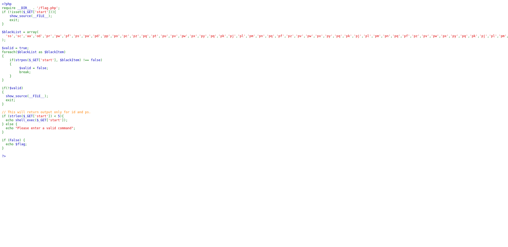
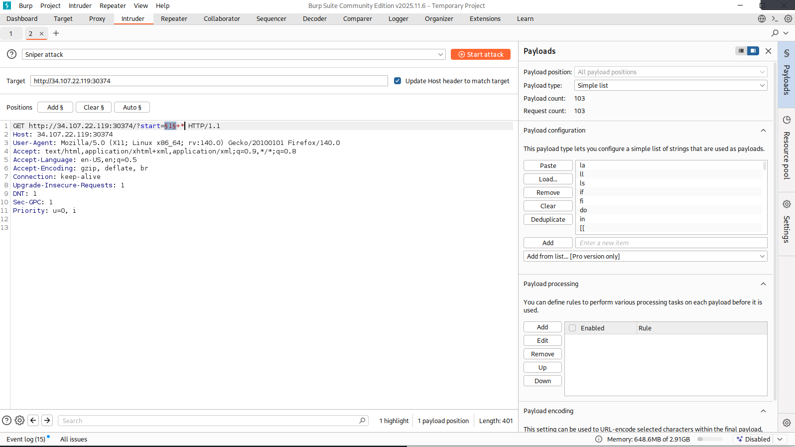

# Category: 🌐 Web

# Difficulty: Medium

# Vulnerability: Command Injection

-----

## Description:

### Our first look is actually at the code behind the entire site. We see that we have a "blacklist," which immediately caught my attention.

-----


## Inspecting:

### Upon further inspection, I have come to a few conclusions:

  * ### The blacklist only contains two-letter commands, but it doesn't include **all** two-letter commands.
  * ### The string of characters used must be under 5 characters long.

-----

## Cruel Realization:

### After some research, I managed to find the command that gives us the flag. However, because it took a lot of time, I will not be showing that specific path (though you are more than welcome to find it yourself).

### Instead, I will share a lesson I learned the hard way (I searched for that command for a full 20 minutes).

-----

## Solution:

### Because this is a web challenge, Burp Suite is your best friend. Let’s use it to its true potential:

  * ### First, we capture the Request and send it to **Intruder**.
  * ### Then, we create a list (or find one) of all existing two-letter commands.
  * ### After that, our Payload becomes:

<!-- end list -->


```
2_Letter_Command+*
```


-----

### After a while, we see that the `m4` command succeeded and we got the flag.

### FLAG (not the actual flag):

```
CTF{791b21ee6421993a8e255REDACTED6ee52e48edb437909cba7e1e80c0579b6be}
```

-----

## Important Lesson:

### We often try to solve challenges quickly and easily, but sometimes we must take our time. What we've learned here is:

> **If you do not know the answer, try all possible answers\!**

-----

